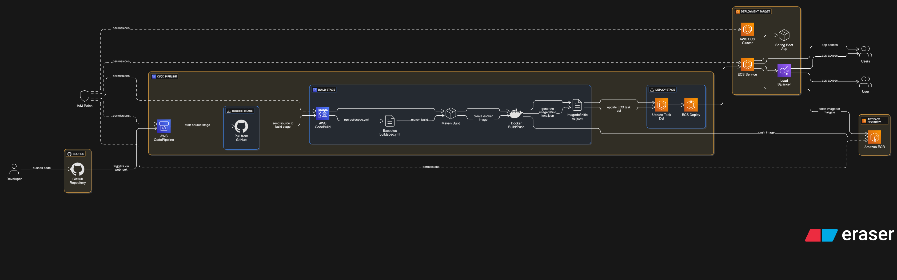

# Spring Boot Deployment to AWS ECS (Fargate) — CI/CD Pipeline

This project demonstrates a **complete CI/CD pipeline** for deploying a Spring Boot application to **AWS ECS (Fargate)** using:

- **AWS CodePipeline**
- **AWS CodeBuild**
- **Amazon ECR**
- **AWS ECS (Fargate)**

---

## 📌 Architecture Overview

 <!-- Replace with your actual diagram path -->

### End-to-End Workflow
1. **Developer pushes code** to a GitHub repository.
2. **AWS CodePipeline** is triggered via a GitHub webhook.
3. **Source Stage** retrieves the latest code from GitHub.
4. **Build Stage** (AWS CodeBuild):
   - Executes `buildspec.yml`.
   - Builds the Spring Boot JAR with Maven.
   - Creates a Docker image from the JAR.
   - Pushes the image to **Amazon ECR**.
   - Generates `imagedefinitions.json` for ECS deployment.
5. **Deploy Stage** updates the ECS Task Definition with the new image.
6. **ECS Service** fetches the image from ECR and deploys it on Fargate.
7. **Users** access the application via the ECS endpoint or Load Balancer.

---

## ⚙️ AWS Services in Use

| Service          | Purpose |
|------------------|---------|
| **IAM Roles**    | Provides permissions for ECS, ECR, CodeBuild, and CodePipeline |
| **CodePipeline** | Automates the CI/CD workflow |
| **CodeBuild**    | Builds the JAR, creates Docker images, and pushes them to ECR |
| **ECR**          | Stores Docker images |
| **ECS (Fargate)**| Runs containers without server management |

---

## 🛠 Build & Deployment Process

### 1. Source Stage
- Triggered via **GitHub webhook**
- Pulls the latest source code

### 2. Build Stage (AWS CodeBuild)
Executed using `buildspec.yml`:

```yaml
version: 0.2
phases:
  pre_build:
    commands:
      - echo Logging in to Amazon ECR...
      - aws ecr get-login-password --region eu-north-1 | docker login --username AWS --password-stdin <ECR_URI>
      - REPOSITORY_URI=<ECR_URI>
      - IMAGE_TAG=build-$(echo $CODEBUILD_BUILD_ID | awk -F":" '{print $2}')
  build:
    commands:
      - mvn clean install
      - docker build -t $REPOSITORY_URI:latest .
      - docker tag $REPOSITORY_URI:latest $REPOSITORY_URI:$IMAGE_TAG
  post_build:
    commands:
      - docker push $REPOSITORY_URI:latest
      - docker push $REPOSITORY_URI:$IMAGE_TAG
      - printf '[{"name":"spring-demo-ecr","imageUri":"%s"}]' $REPOSITORY_URI:$IMAGE_TAG > imagedefinitions.json
artifacts:
  files:
    - imagedefinitions.json
    - target/springboot-aws-deploy.jar
```


## 🚀 How to Deploy

1. **Create ECR Repository**:  
   aws ecr create-repository --repository-name spring/demo-ecr --region eu-north-1

2. **Set up ECS Cluster & Service**:  
   - Create an ECS cluster with Fargate launch type.  
   - Create a service and task definition.

3. **Create CodePipeline**:  
   - Source: GitHub  
   - Build: CodeBuild (with buildspec.yml)  
   - Deploy: ECS (Fargate)

4. **Push Code to GitHub**:  
   git add .  
   git commit -m "Deploy Spring Boot App"  
   git push origin main  

5. Pipeline will trigger automatically and deploy to ECS.

---

## ✅ Key Benefits of This Setup

- Fully automated CI/CD pipeline.  
- Zero server management using Fargate.  
- Scalable and secure deployment with IAM roles.  
- Dockerized application for portability.
